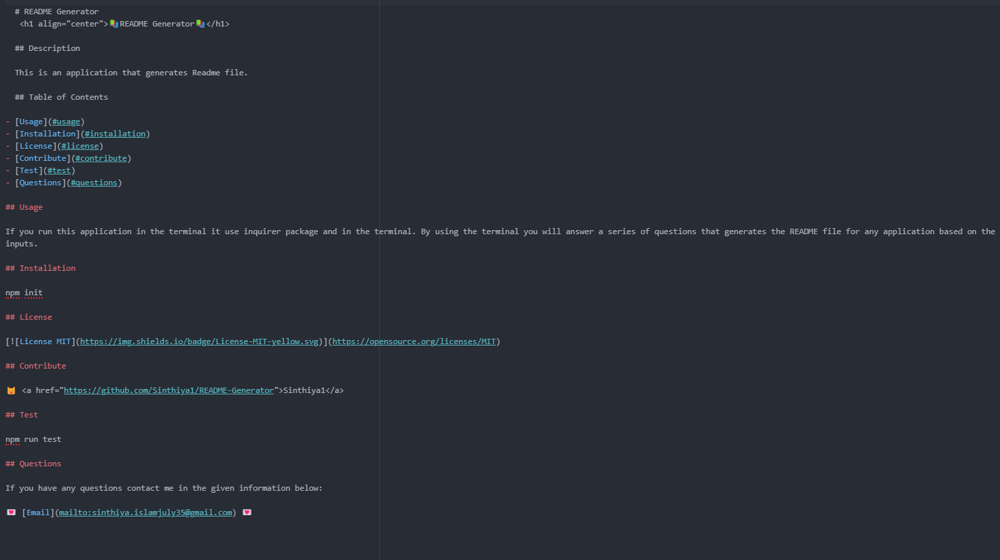

  # README Generator
   <h1 align="center">📚README Generator📚</h1>

  ## Description

  This is an application that generates Readme file.
  
  ## Table of Contents

- [Usage](#usage)
- [Installation](#installation)
- [License](#license)
- [Contribute](#contribute)
- [Test](#test)
- [Questions](#questions)

## Usage

If you run this application in the terminal it use inquirer package and in the terminal. By using the terminal you will answer a series of questions that generates the README file for any application based on the inputs.

## Installation

npm init

## License

## Contribute

😺 <a href="https://github.com/Sinthiya1/README-Generator">Sinthiya1</a>

## Test

`npm run test`

## Mock Up

## Questions

If you have any questions contact me in the given information below:

💌 [Email](mailto:sinthiya.islamjuly35@gmail.com) 💌

